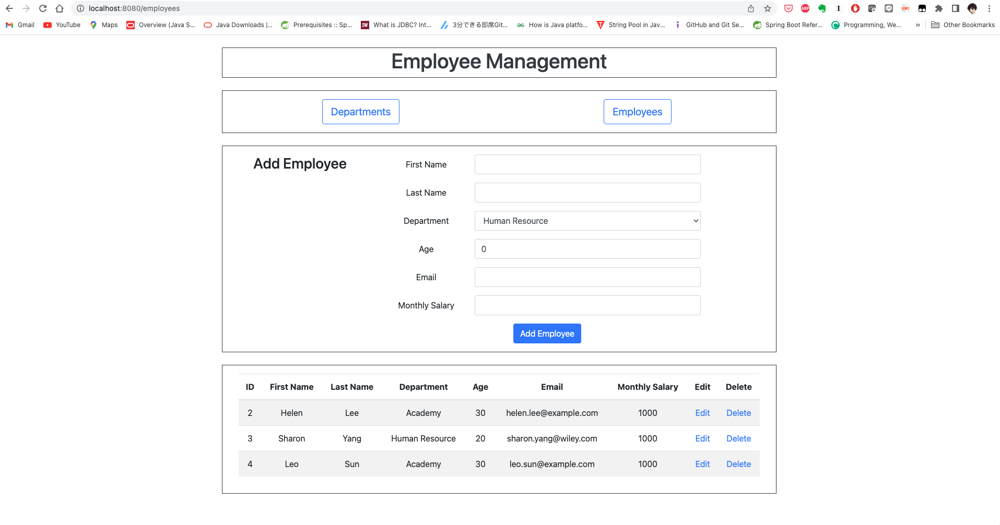
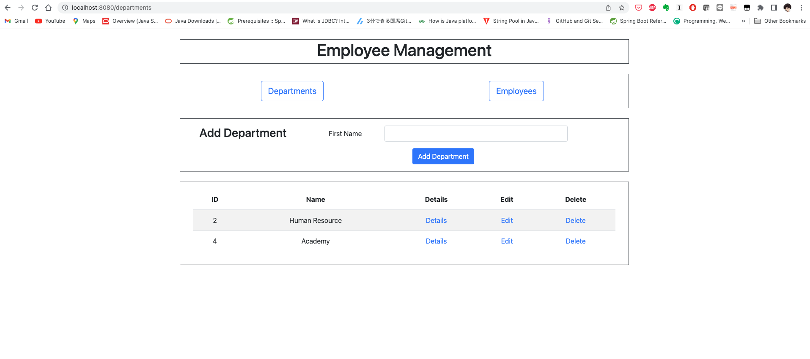

# Employee Management

Employee management provides management functions for employees and their departments

We need to implement the management system as follows:

- Implement data persistence services using JPA to provide CRUD operations for employees and departments.
- Implement web pages using thymeleaf to provide user interface for the system.
- Implement web service endpoints to receive requests from UI and provide responses by communicating with data persistence.

Below are the main UI for employee and department management respectively.

## Problem Statement

You need to implement below requirements to complete this assignment.

- Use JPA annotation to indicate entity objects and their properties to enable JPA support for Employee and Department. Please consider the ManyToOne relationship from Employee to Department and the OneToMany relationship from Department to Employee.
- Define Repositories for Employee and Department. For Employee entity, define EmployeeRepository which extends JpaRepository to operate employee objects in the database. Similarly, define DepartmentRepository to operate department objects.
- Use JPA validation to validate if the objects to be created or updated in DepartmentController and EmployeeController are validated. Refer comments in source codes for details.
